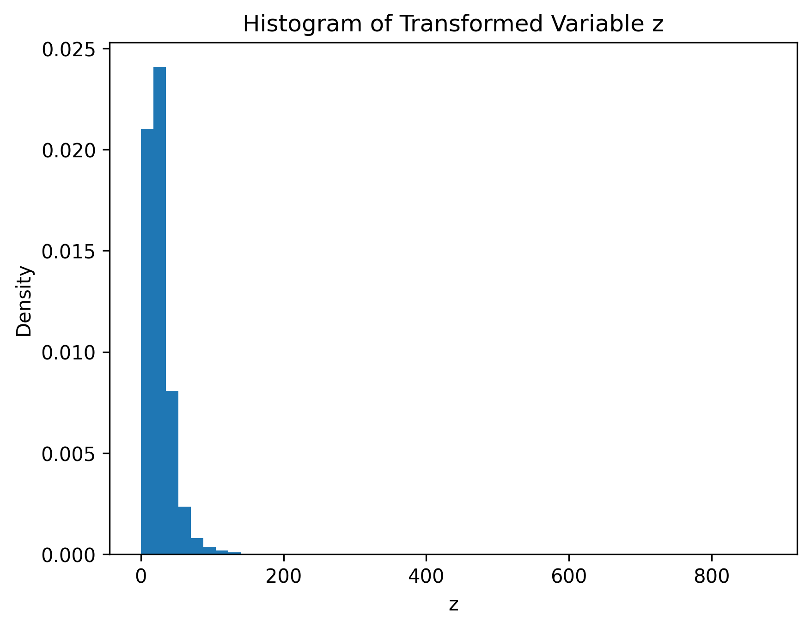
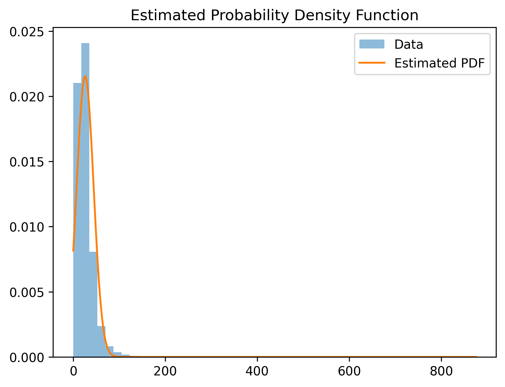

# NO2 PDF Estimation using Non-Linear Transformation

## Objective
The objective of this project is to learn the probability density function (PDF) of air quality data after applying a roll-number-parameterized non-linear transformation. The analysis is performed using NO2 concentration values from an Indian air quality dataset.

---

## Dataset
- **Source:** India Air Quality Dataset (Kaggle)
- **Feature used:** NO2
- **Preprocessing:** Missing values were removed before analysis

---

## Non-Linear Transformation
The original input variable \( x \) (NO2 concentration) is transformed using the following non-linear function:

\[
z = x + a_r \sin(b_r x)
\]

where:
- \( a_r = 0.05 \times (r \bmod 7) \)
- \( b_r = 0.3 \times (r \bmod 5 + 1) \)
- \( r \) is the university roll number

This transformation introduces controlled non-linearity into the data.

---

## Transformed Variable Analysis

### Histogram of Transformed Variable
The distribution of the transformed variable \( z \) is visualized below:

---

## Probability Density Function Model
The probability density function of the transformed variable \( z \) is modeled as:

\[
\hat{p}(z) = c \cdot e^{-\lambda (z - \mu)^2}
\]

where:
- \( \mu \) is the mean of the transformed variable
- \( \lambda \) controls the spread of the distribution
- \( c \) is the normalization constant

The parameters are estimated using Maximum Likelihood Estimation (MLE).

---

## Estimated PDF Parameters

| Parameter | Description | Value |
|----------|------------|-------|
| \( \mu \) | Mean of transformed variable | 25.811446214420034 |
| \( \lambda \) | Spread parameter | 0.0014605519159744307 |
| \( c \) | Normalization constant | 0.021561727995208047 |

---

## Estimated Probability Density Function
The fitted probability density function overlaid on the data distribution is shown below:

---

## Repository Structure
- `analysis.ipynb` : Jupyter notebook containing full implementation and outputs  
- `data/` : Dataset files  
- `outputs/` : Generated plots and visualizations  
- `requirements.txt` : Required Python libraries  

---

## Conclusion
In this project, a roll-number-based non-linear transformation was applied to NO2 air quality data, and the resulting distribution was successfully modeled using a Gaussian-like probability density function. The estimated PDF closely matches the empirical distribution, demonstrating the effectiveness of the chosen transformation and parameter estimation approach.

---

## Notes
All detailed computations, intermediate results, and additional visualizations are available in the Jupyter notebook (`analysis.ipynb`).
